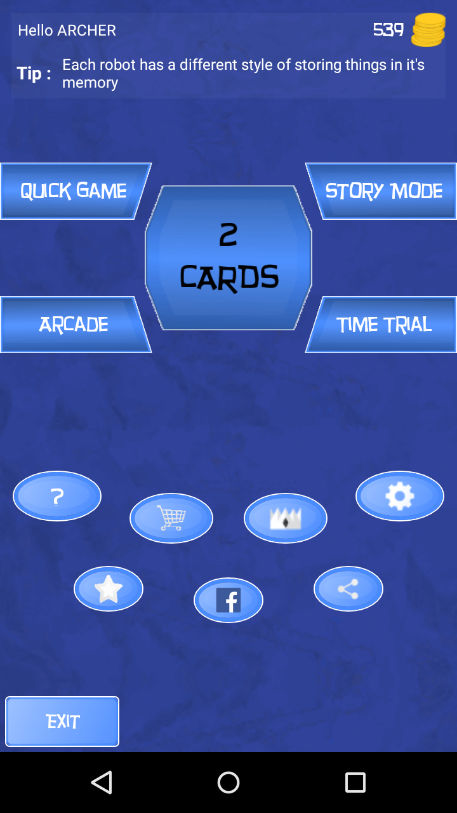
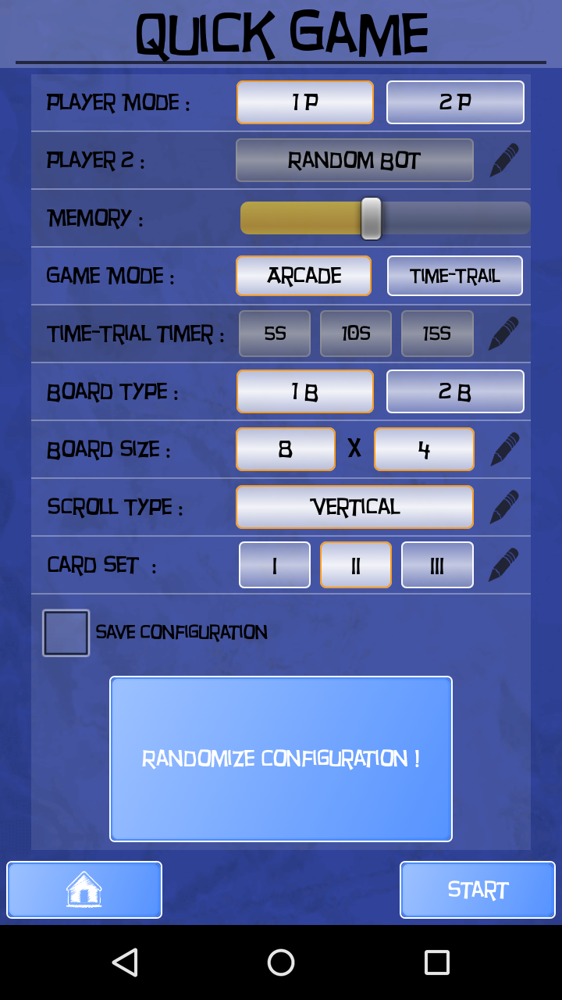
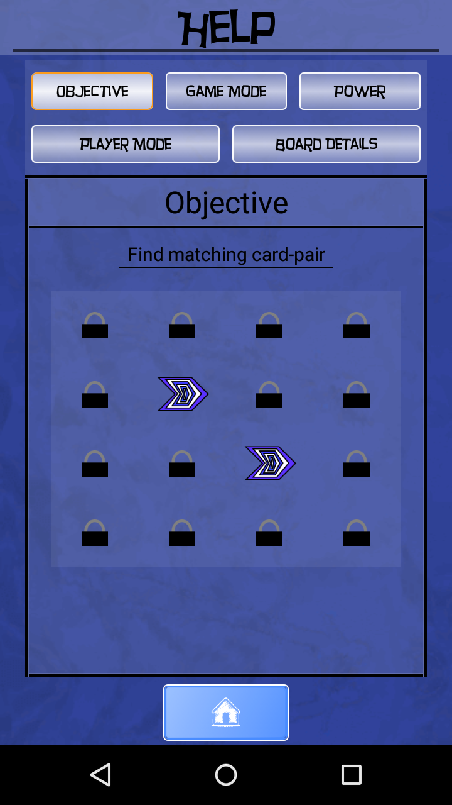
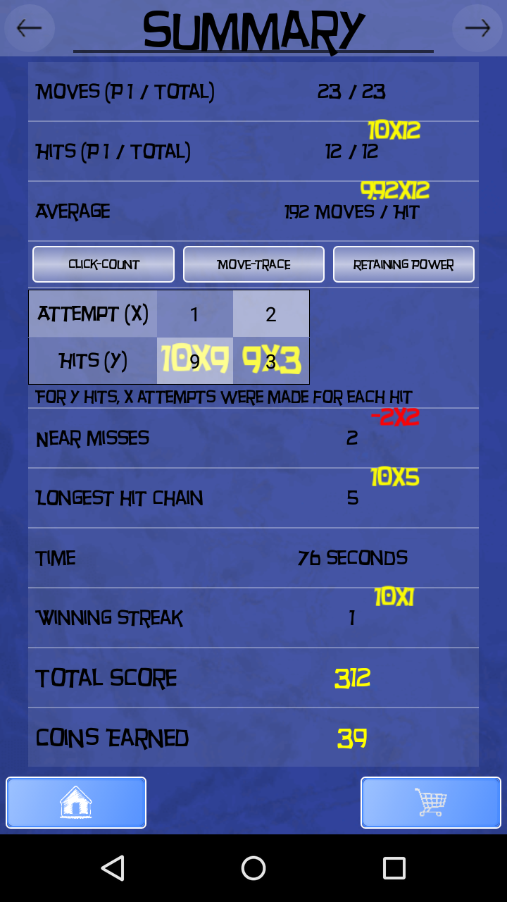
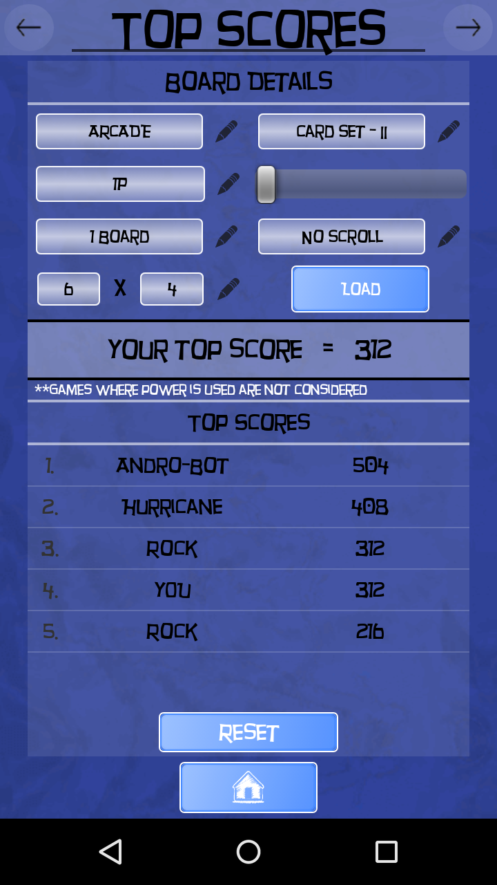
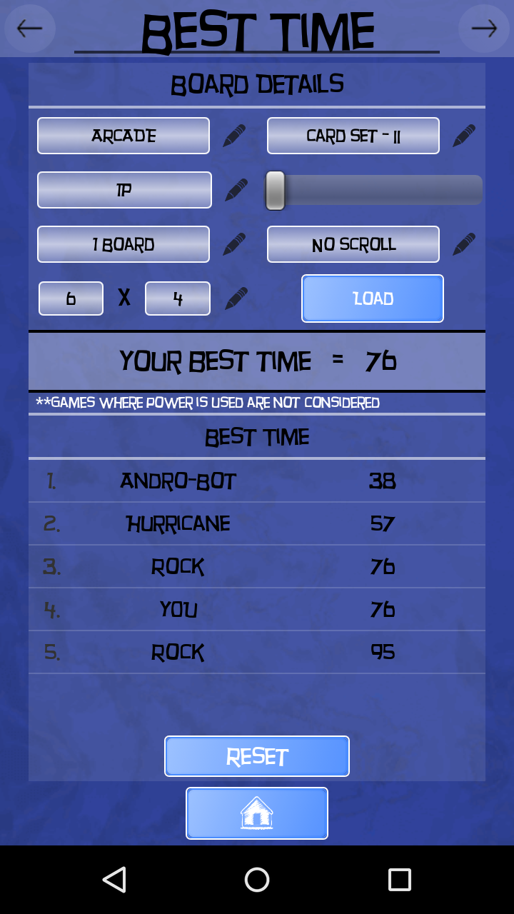
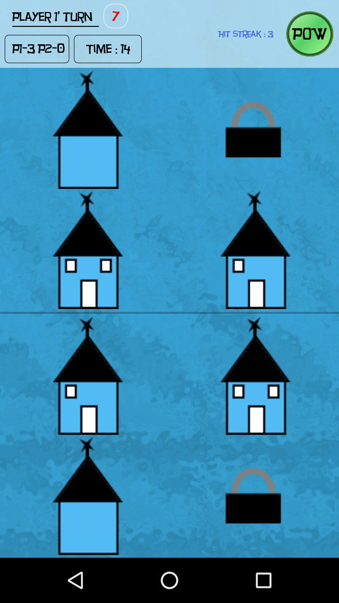
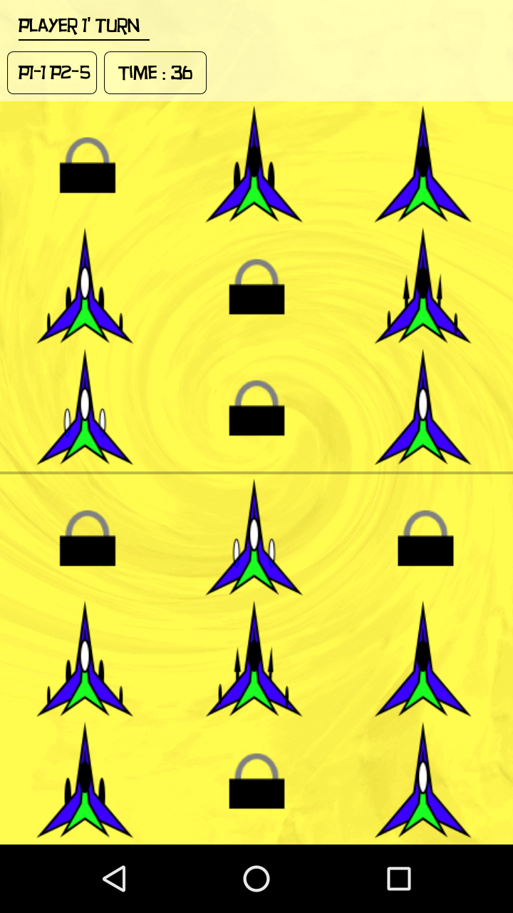
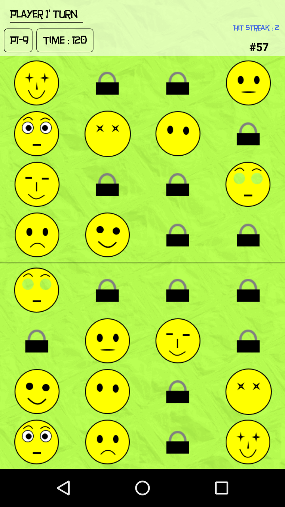

# Two Cards
Classic card game where you have to find matching card pairs.
Fun way to train your memory power!

Objective : Find all card pairs on board
2 Cards offers various game playing options like :
● Board Size :
- From 2x2 to 15x8 cards on board!
● Board Type :
- Play a one board game where all cards are present on the same board
- Or Play a two board game where matching cards are present on a different board
● Player Modes :
- Play in One Player mode 
- Play against Robots
- Play in manual Two Player mode
● Robot players with varying difficulty 
● Game Modes :
- Complete a static board in Arcade mode 
- Find card pairs before timer goes out & replaces cards present on the board in Time Trial mode
- Set custom timer value in Time Trial mode
● Scroll Types : 
- Create a scroll-able board! (Horizontal/Vertical/Both) 
● Card Set :
- Choose the complexity of cards on board
● Over 500 cards
● Over 2000 levels in Story Mode
● Earn coins & buy awesome powers to use in game
● Get detailed summary of your performance for a board (Near misses, Click count, Attempt to Hit ratio, etc. )
● Track your top-scores, best times & least moves 
● Share your score with friends
● Accept challenges to earn extra coins

Link to the game on play store : 
https://play.google.com/store/apps/details?id=com.archer.matching_card_game.two_cards

#Screenshots:

